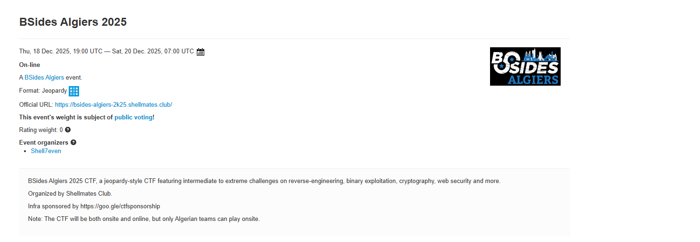

# 🟢 kramazon

Contents:

1. [Description](kramazon.md#id-1.-description)
2. Enumeration of website

#### 1.Description

<figure><figcaption></figcaption></figure>

2. #### Enumeration of website

<figure><figcaption></figcaption></figure>

* visit the website
* for now let's only analyze resources or pages which has host name https://kramazon.csd.lol/

<figure><figcaption></figcaption></figure>

* go to Target -> site map -> add to scope

<figure><figcaption></figcaption></figure>

* for now i will only be dealing with kramazon

<figure><figcaption></figcaption></figure>

* after careful inspection i identified Order Now is the only working functionality

<figure><figcaption></figcaption></figure>

4. after clicking it i observed it created 3 requests(highlighted in yellow)

* in the 1st request above there's interesting callback\_url in response that we can intercept the response and make changes with it

<figure><figcaption></figcaption></figure>

* 2nd request and it's response

<figure><figcaption></figcaption></figure>

* 3rd request and response
* here i still don't understand how did response get user id because there was no login and it set-cookie when visiting it's home page so it's cookie used as user id and in request body there is no mention of user id

<figure><figcaption></figcaption></figure>

5. cookie is base64 encoded

<figure><figcaption></figcaption></figure>

6. so i just changed base64 cookie from BA to BB and it changed user id in response

* i tried manipulating it but can't get user id 1

<figure><figcaption></figcaption></figure>

7. now let's look at how requests are created

* in home page inside response i don't see create-order or finalize request codes but have javascript called script.js

<figure><figcaption></figcaption></figure>

* there is create-order and finalize requests in this javascript and there is a interesting function which has XOR but it's an unused code left as a hint so note down that hexadecimal `0x37`

<figure><figcaption></figcaption></figure>

8. let's decode our cookie  using base64 decoder in burp

<figure><figcaption></figcaption></figure>

9. after base64 decoding i took the first byte which is `0x04`  and did XOR decoding (you can also use windows calculator in programmer mode)

* do with all the other hex and convert it to ascii to get our user id

<figure><figcaption></figcaption></figure>

10. let's forge the cookie using user id 1

<figure><figcaption></figcaption></figure>

* to forge the cookie convert ascii `1` to hexadecimal which is `31` in hexadecimal

<figure><figcaption></figcaption></figure>

* now i will XOR encode it using `0x37` which is `0x31` XOR `0x37` = `0x06`

<figure><figcaption></figcaption></figure>

* encode the XOR result using base64

<figure><figcaption></figcaption></figure>

11. copy and paste that base64 encoded forged cookie in request and also URL encode like above screenshot

* we only got half the flag but now we know the location of full flag which is displayed in the response

<figure><figcaption></figcaption></figure>

12. now modify request to the flag path and we will get the full flag

Conclusion: During source code analysis, unused code revealed XOR-based logic which made it possible to decode the XOR obfuscation of the cookie and used that same XOR obfuscation logic to forge our own cookie leading to IDOR vulnerability.
