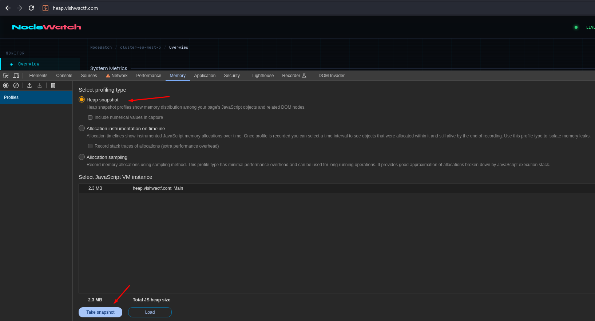

# 🟢 Heap of secrets

<figure><figcaption></figcaption></figure>

when it said "Take a snapshot" i instantly knew it was about memory snapshot

<figure><figcaption></figcaption></figure>

1. so visit site and take a snapshot

<figure><figcaption></figcaption></figure>

2. `ctrl + F` to search type `ctf{}` done got the flag
3. another method is to import and do string search
